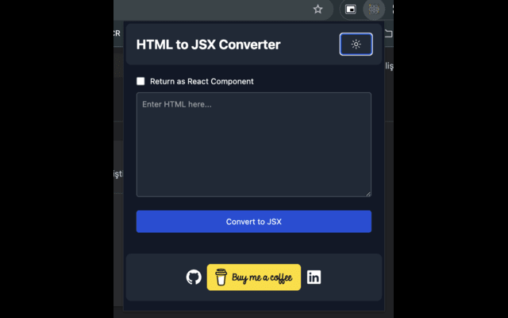
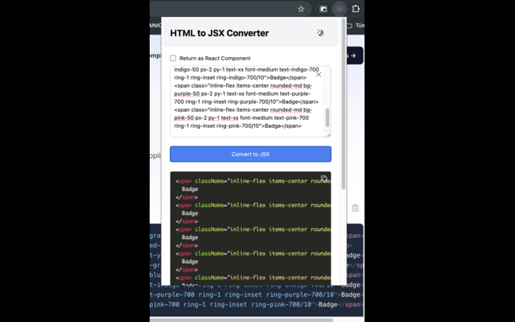
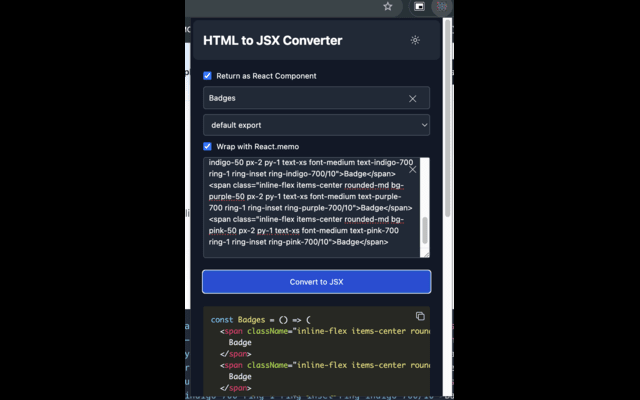
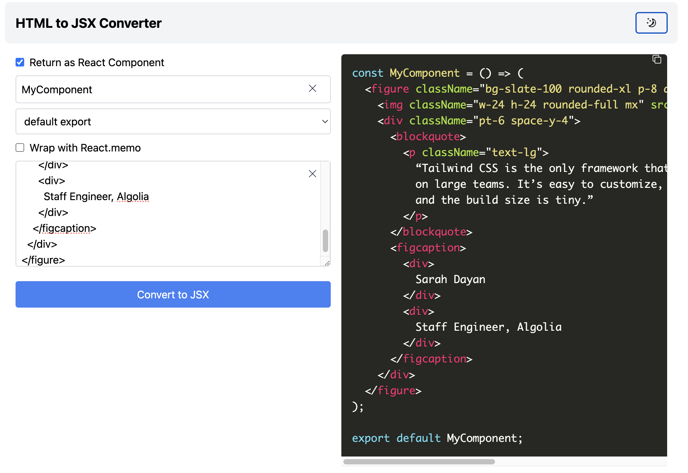

# HTML to JSX Chrome Extension


<a href="https://www.buymeacoffee.com/ebirkan" target="_blank"></a>

## 📖 Overview

HTML to JSX Chrome Extension is a tool designed to simplify the conversion of HTML code into JSX, the syntax extension for JavaScript used in React. This extension allows developers to quickly convert HTML code to JSX, making their workflow more efficient and streamlined.

## 🎯 Purpose

The primary purpose of this extension is to help developers working with React by providing an easy-to-use tool that converts HTML to JSX. This is especially useful for those transitioning from HTML-based projects to React or for anyone needing to incorporate HTML code snippets into their React projects.

## 🚀 Features

- Convert HTML to JSX easily.
- Option to create a React functional component from the converted JSX.
- Choose between default and named exports for the React component.
- Option to wrap the component with `React.memo` for optimization.
- Clear the input field with a single click.
- Copy the converted JSX to clipboard with one click.
- Responsive design with light and dark modes.

## 🛠️ Technologies and Libraries Used

- **React**: For building the user interface.
- **TypeScript**: For static type checking.
- **Vite**: For fast and optimized development and build tooling.
- **Tailwind CSS**: For styling the application.
- **react-hook-form**: For managing form state and validation.
- **react-syntax-highlighter**: For displaying the converted JSX with syntax highlighting.
- **Radix Icons**: For icons used in the application.

## 📦 Installation

1. **Clone the repository:**

   ```bash
   git clone https://github.com/birkankervan/html-to-jsx-chrome-extension.git
   cd html-to-jsx-chrome-extension
   ```

2. **Install the dependencies:**

   ```bash
   bun install
   ```

3. **Build the project:**

   ```bash
   bun run build:chrome
   ```

4. **Load the extension in Chrome:**

   - Open Chrome and navigate to `chrome://extensions/`.
   - Enable "Developer mode" in the top right corner.
   - Click "Load unpacked" and select the `dist` folder from your project directory.

## 📝 Usage

1. Open the extension by clicking the extension icon in the Chrome toolbar.
2. Enter your HTML code in the provided textarea.
3. Select options to create a React component, choose export type, and wrap with `React.memo` if desired.
4. Click "Convert to JSX" to see the converted JSX code.
5. Click the copy icon to copy the JSX code to your clipboard.
6. Use the clear icon to clear the input field.

## 📸 Screenshots






## 👨‍💻 Author

**Emre Birkan Kervan**

- GitHub: [birkankervan](https://github.com/birkankervan)
- LinkedIn: [emre-birkan-kervan](https://www.linkedin.com/in/emre-birkan-kervan)

## ⭐ Acknowledgements

- Thanks to all the open-source contributors whose work was used in this project.
- Special thanks to the React community for their continuous support and resources.

---

Feel free to contribute, open issues, or suggest features to make this tool even better!
